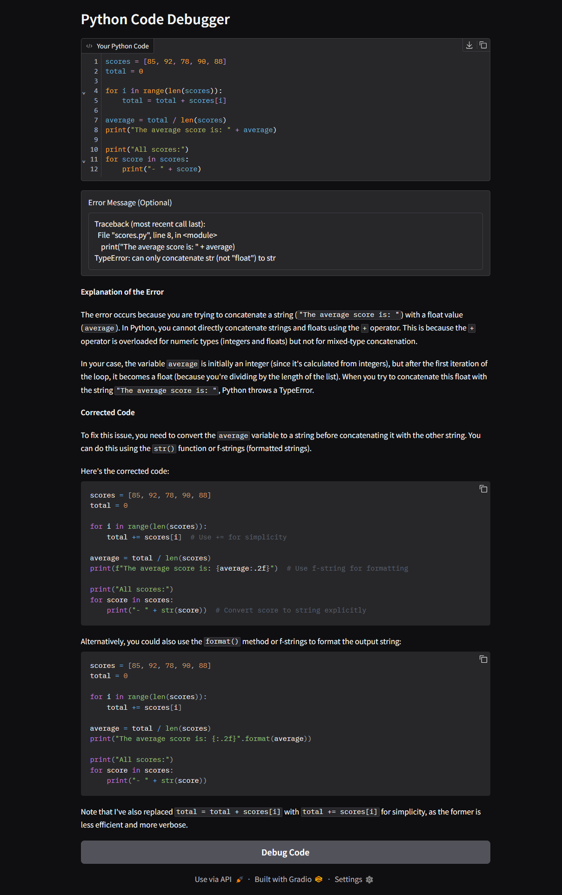
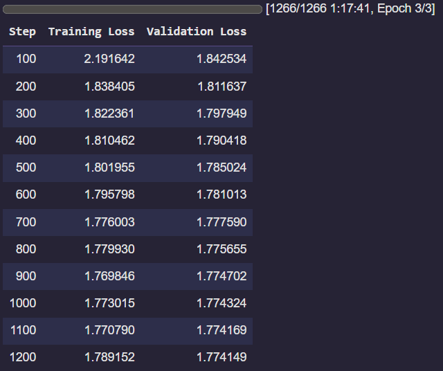
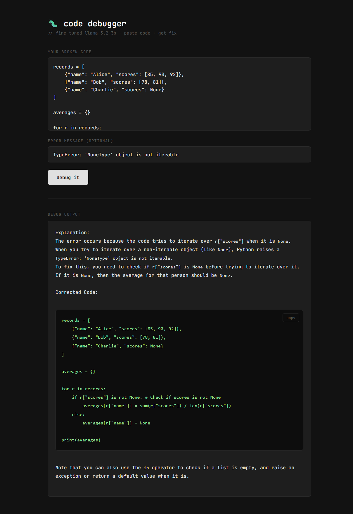

# Python Code Debugger using QLoRA Fine-Tuning

**Fine-tuned Meta's Llama 3.2 3B model to debug Python code errors using Stack Overflow data (filtered for errors)**

### This model is deployed and is live on HF Spaces: https://huggingface.co/spaces/sarthakmasta/CodeDebuggerLlama

This project demonstrates parameter-efficient QLoRA fine-tuning on a code debugging task. Trained on Stack Overflow Python questions, the model learns to spot bugs and problems within code, explain the errors, and provide corrected code with explanations.
Llama 3.2 3B already has general coding knowledge, but this fine-tune grounds it in real-world Stack Overflow bugs. The real world errors developers actually run into make it more direct and practical for debugging tasks.

Here's the dataset used: `koutch/stackoverflow_python`

## Images

### Gradio Interface with Example Debugging:

### Training Output:

### Deployed Model on HF Spaces:

### Google Colab Notebook Link:
https://colab.research.google.com/drive/1x6XLGQT-0DofY_mHH-CN4fbF93o7rCki?usp=sharing

## Technical Stack

- **Base Model**: Llama 3.2 3B Instruct
- **Fine-tuning Method**: QLoRA (4-bit quantization + LoRA adapters)
- **Dataset**: Stack Overflow Python Q&A (filtered for errors)
- **Framework**: HuggingFace Transformers, PEFT, TRL
- **Training Hardware**: NVIDIA A100 GPU (T4 can be used as well, with a few tweaks to the code)
- **Interface**: Gradio for demo, FastAPI + HTML/JS (deployed on HuggingFace Spaces)

## Project Overview

**1. Data Preparation**
- Loaded Stack Overflow Python dataset (987k questions)
- Filtered for questions that include errors or exceptions (431k questions)
- Applied quality filter (answers must contain code, minimum length 150 chars)
- Truncated responses to 1,200 characters (up from 600)
- Selected 15,000 examples for quality-filtered training
- Formatted data into instruction-response pairs

**2. Model Fine-tuning**
- Used Llama 3.2 3B Instruct as the base model
- Applied QLoRA for efficient fine-tuning (r=16, target: q/k/v/o projections)
- Learning rate: 5e-5 with cosine scheduler and warmup
- Early stopping with patience=3 based on validation loss
- Best checkpoint selected automatically via load_best_model_at_end
- Trained the model to explain errors and provide corrected Python code

**3. Model Export**
- Merged LoRA adapters into the base model after fine-tuning
- Pushed to HuggingFace Hub: sarthakmasta/code-debugger-llama
- Deployed as a FastAPI app on HuggingFace Spaces: (https://huggingface.co/spaces/sarthakmasta/CodeDebuggerLlama)

## Setup Instructions

### Prerequisites

- Python 3.10+
- NVIDIA A100 40GB GPU (T4 can be used as well, with a few tweaks to the code)
- CUDA 11.8 or higher
- HuggingFace token

**Note**: You’ll need to agree to Meta’s terms and conditions and share your contact information to request access to the Llama 3.2 model family. Access is generally granted in a few minutes or so. The model is gated, but the terms are harmless and are just used to ensure it’s not used for any illegal or unethical purposes. You can request access from this link (https://huggingface.co/meta-llama/Llama-3.2-3B-Instruct)

### Installation

Install all dependencies by running the first cell in the notebook on Colab.

### Hugging Face Authentication

1. Get access to Llama 3.2 on HuggingFace
2. Create a token at https://huggingface.co/settings/tokens
3. In Google Colab, add token to Secrets as `HF_TOKEN`

### Running the Notebook

1. Run all cells from top to bottom
2. Training will take approximately 1.5 hours on A100. T4 is not recommended due to memory constraints with the current configuration.
3. After training, access the model in the Gradio interface

## Limitations

- Works better on Stack Overflow styled questions  
- Might struggle with very tricky or rare bugs  
- Can only handle code snippets, not full projects  
- Can’t actually run code to check fixes

## Future Enhancements

- Support more programming languages
- Train with a bigger subset of data along with more trainable parameters 
- Look up rare errors using external sources  
- Train on more datasets

## License

This project is for educational purposes. Llama 3.2 is released under Meta's license. The StackOverflow dataset follows CC BY-SA licensing.